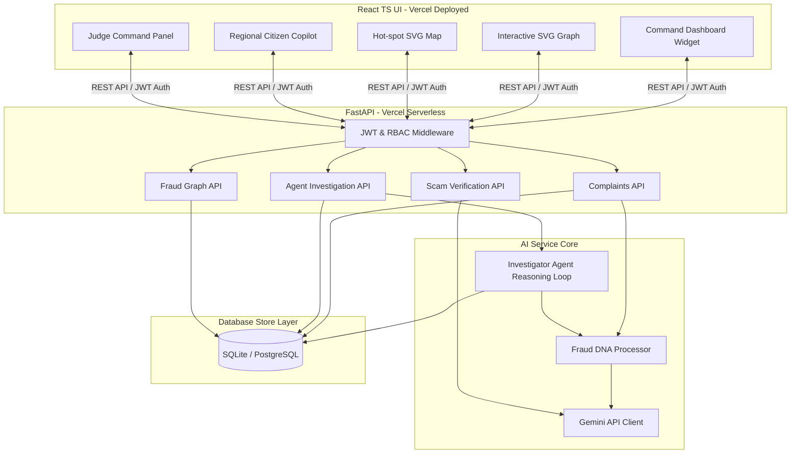
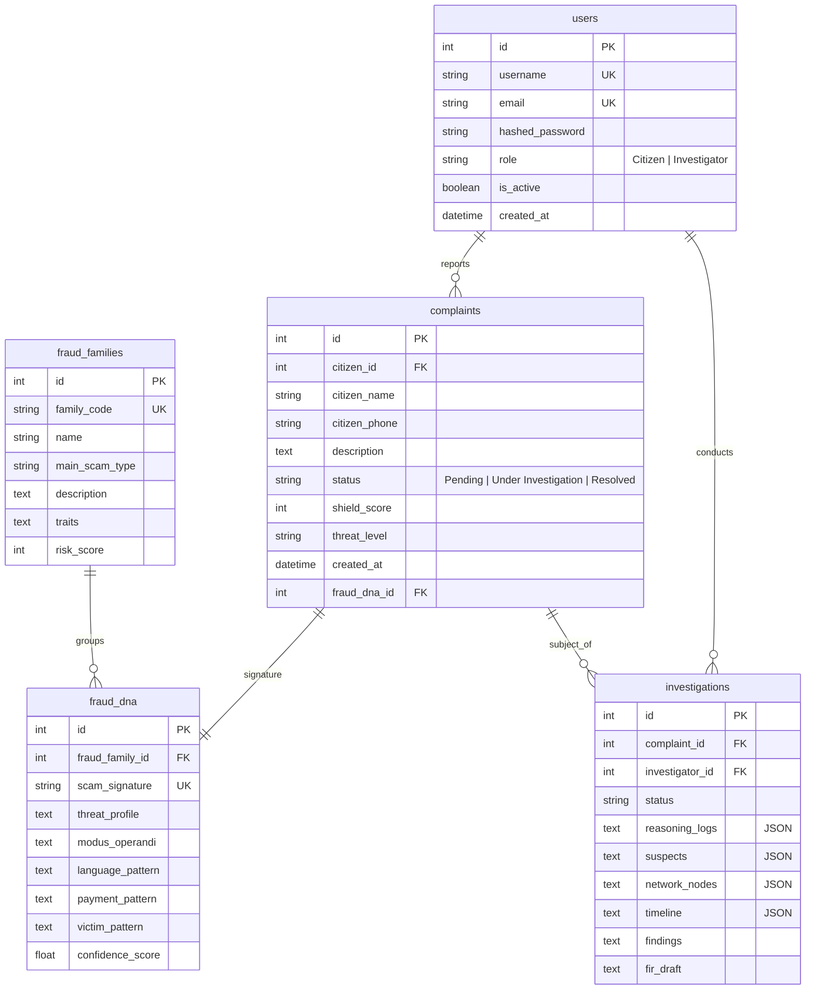

# SHIELD AI – National Digital Fraud Prevention & Public Safety Intelligence Platform

SHIELD AI is a state-of-the-art, national-level digital fraud prevention and public safety intelligence operating system designed to detect, track, visualize, and mitigate digital financial fraud. It integrates multiple advanced telemetry streams, geospatial mapping, network graph visualization, and interactive AI copilot assistance to empower both law enforcement agencies and citizens.

Designed and developed for the **ET AI Hackathon 2.0** by team **TEAM SUKUMARKARNAM4** from **Nalanda Degree College**.

---

## 🚀 Live Public Deployments

*   **🌐 Live Demo Link (Frontend)**: [https://frontend-smoky-psi-23.vercel.app](https://frontend-smoky-psi-23.vercel.app)
*   **⚙️ Core API Link (Backend)**: [https://backend-gray-alpha-78.vercel.app](https://backend-gray-alpha-78.vercel.app)
*   **📑 Swagger API Documentation**: [https://backend-gray-alpha-78.vercel.app/docs](https://backend-gray-alpha-78.vercel.app/docs)
*   **🎥 4-Minute Demo Video**: [Watch Demo Video (GitHub MP4)](https://github.com/sukumar2351/SHIELD-AI-National-Digital-Fraud-Prevention-Public-Safety-Intelligence-Platform/blob/main/SHIELD_AI_ET_AI_HACKATHON_DEMO.mp4)

---

## 🌟 Core Modules

### 1. 📊 Executive Command Dashboard (`/dashboard`)
Provides high-level intelligence and threat metrics across the nation:
*   **Top Metrics**: Total Complaints, Active Fraud Families, SHIELD Threat Score, Active Investigations, FIRs Generated.
*   **Analytics Widgets**: High-Risk States & Districts rankings, Threat Alerts, Fraud Family Distribution, and Threat Timelines.

### 2. 🧬 Fraud DNA Profile Engine (`/dna`)
Multi-dimensional analysis of fraud typologies using deep profiling:
*   Profiles fraud families by Communication, Financial, Behavioral, Language, and Geo DNA.
*   Interactive data visualizations (Pie, Bar, Area, and Trend charts) showing fraud behavior evolution.

### 3. 🕸️ Fraud Graph Intelligence Network (`/graph`)
Network analysis mapping entity relationships:
*   Interactive node-link visualization of fraud networks using **React Flow**.
*   Trace complex relationships between Victims, Fraudsters, UPI IDs, and Phone Numbers.
*   Features cluster filtering, node expansion, search capabilities, and connection highlighting.

### 4. ⚖️ Autonomous Investigation Center (`/investigations`)
Workflow management system for law enforcement officers:
*   Centralized queue of active cases with search, priority sorting, and threat level categorization.
*   Real-time case timeline tracking.
*   **Automated FIR (First Information Report) Generation** with instant preview and download capabilities.

### 5. 🗺️ Geospatial Threat Dashboard (`/geospatial`)
Geographic visualization of threats across India:
*   Interactive India Map showing state-level and district-level threat heatmaps.
*   Analyze fraud family spread and local threat growth trends.
*   Risk-ranking tables for localized intervention.

### 6. 🤖 Citizen Copilot Assistant (`/copilot`)
A multilingual conversational safety assistant for the public:
*   Interactive chat interface for fraud verification and complaint pre-checking.
*   Instant SHIELD Safety Score & Threat Level evaluations.
*   Real-time safety recommendations and preventative tips customized to the threat.

---

## 🏗️ System Architecture & AI/Graph Pipeline



### Entity Relationship Model



---

## 🛠️ Technology Stack & Platform Settings

### Frontend
*   **Core**: React 18, TypeScript, Vite
*   **Styling**: Vanilla CSS with custom utility variables (Dark Navy & Electric Blue Cyber Security glassmorphism theme)
*   **Graph Engine**: React Flow
*   **Charts**: Recharts
*   **Icons**: Lucide React
*   **Hosting**: Vercel

### Backend
*   **Framework**: FastAPI (Python 3.12)
*   **ORM**: SQLAlchemy
*   **Database**: SQLite (configured for `/tmp` writable storage in serverless runtime, auto-seeded on startup)
*   **Migrations**: Alembic
*   **Hosting**: Vercel Serverless Functions

---

## 📂 Project Structure

```
├── backend/                  # FastAPI Backend application
│   ├── app/                  # Main application package (models, schemas, routers, core)
│   ├── alembic/              # Database migration scripts
│   ├── requirements.txt      # Python dependencies (including email-validator)
│   ├── Dockerfile            # Container definition for backend
│   ├── vercel.json           # Vercel Serverless deploy settings
│   └── .env.example          # Backend configuration template
├── frontend/                 # React Frontend application
│   ├── src/                  # React components, pages, hooks, and routing
│   ├── package.json          # Node dependencies & scripts
│   ├── Dockerfile            # Nginx-based production frontend container
│   ├── vercel.json           # Vercel Router & SPA deployment configuration
│   └── vite.config.ts        # Vite build configuration
├── docker-compose.yml        # Multi-container local orchestration file
├── DEPLOYMENT_GUIDE.md       # Step-by-step production hosting guide
├── DEMO_RUNBOOK.md           # Step-by-step demo evaluation walkthrough
└── FINAL_DEPLOYMENT_CHECKLIST.md # Quality assurance check sheet
```

---

## 🚀 Getting Started

### Prerequisites
*   [Docker & Docker Compose](https://www.docker.com/) (Optional, for containerized run)
*   [Python 3.11+](https://www.python.org/)
*   [Node.js 18+](https://nodejs.org/)

### Method 1: Quick Start with Docker
To spin up the entire platform (Database, FastAPI Backend, and Nginx-served Frontend) locally:
1. Clone this repository and navigate to the project directory:
   ```bash
   git clone https://github.com/sukumar2351/SHIELD-AI-National-Digital-Fraud-Prevention-Public-Safety-Intelligence-Platform.git
   cd "SHIELD AI – National Digital Fraud Prevention & Public Safety Intelligence Platform"
   ```
2. Start the services:
   ```bash
   docker-compose up --build
   ```
3. Open your browser:
   *   **Frontend UI**: [http://localhost:80](http://localhost:80)
   *   **API Documentation**: [http://localhost:8000/docs](http://localhost:8000/docs)

### Method 2: Manual Local Development

#### 1. Running the Backend
1. Navigate to the backend folder and create a virtual environment:
   ```bash
   cd backend
   python -m venv .venv
   source .venv/bin/activate  # On Windows: .venv\Scripts\activate
   ```
2. Install dependencies:
   ```bash
   pip install -r requirements.txt
   ```
3. Run database migrations and seed data:
   ```bash
   alembic upgrade head
   ```
4. Start the FastAPI server:
   ```bash
   uvicorn app.main:app --reload --port 8000
   ```

#### 2. Running the Frontend
1. Navigate to the frontend folder:
   ```bash
   cd ../frontend
   ```
2. Install package dependencies:
   ```bash
   npm install
   ```
3. Run the development server:
   ```bash
   npm run dev
   ```
4. Open [http://localhost:5173](http://localhost:5173) in your browser.

---

## ☁️ Cloud Deployment Configuration

This project is configured for serverless production deployments on Vercel:

### 1. Backend Serverless Function (`backend/vercel.json`)
Deploys FastAPI as a serverless API function, mapping SQLite database files to `/tmp` writable folder. On instance cold starts, the database auto-seeds if empty.
```json
{
  "version": 2,
  "builds": [
    {
      "src": "app/main.py",
      "use": "@vercel/python"
    }
  ],
  "routes": [
    {
      "src": "/(.*)",
      "dest": "app/main.py"
    }
  ],
  "env": {
    "DATABASE_URL": "sqlite:////tmp/shield_fios.db"
  }
}
```

### 2. Frontend SPA Routing (`frontend/vercel.json`)
Deploys Vite static bundle with single-page-routing directives to prevent routing failures when pages are reloaded.
```json
{
  "cleanUrls": true,
  "trailingSlash": false,
  "routes": [
    { "handle": "filesystem" },
    { "src": "/(.*)", "dest": "/index.html" }
  ]
}
```

---

## 👥 Team: TEAM SUKUMARKARNAM4 (Nalanda Degree College)

*   **Sukumar Karanam** — Lead Developer & AI Architect
*   **Shaik Mujeeb Basha** — Backend Developer
*   **Bondada Tejendra** — Database Engineer
